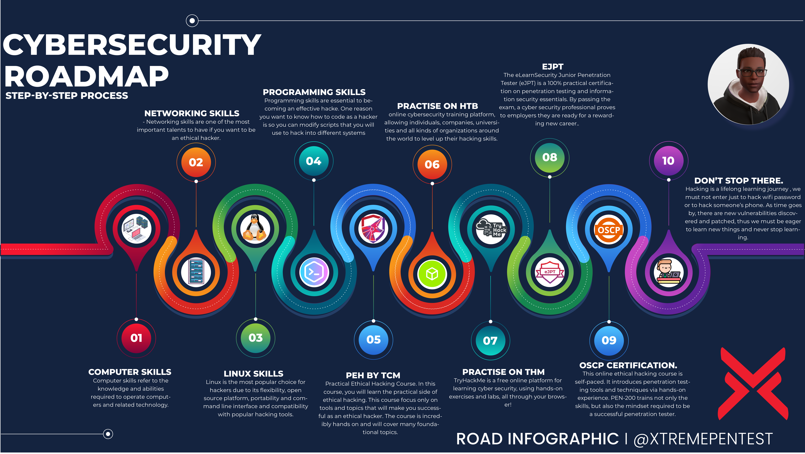

# Cybersecurity-Roadmap
# The Ultimate Hacker's Roadmap 2022

Donwload the roadmaps here: https://github.com/0xTRAW/Cybersecurity-Roadmap/tree/main/maps

1. Basic Computer Skills - Computer skills refer to the knowledge and abilities required to operate computers and related technology.
  
2. Basic Networking Skills - Networking skills are one of the most important talents to have if you want to be an ethical hacker.
  
3. Linux Skills - Linux is the most popular choice for hackers due to its flexibility, open source platform, portability and command line interface and compatibility with popular hacking tools.
  
4. Programming/Scripting Skills - Programming skills are essential to becoming an effective hacke. One reason you want to know how to code as a hacker is so you can modify scripts that you will use to hack into different systems
  
5. PEH by TCM - In this course, you will learn the practical side of ethical hacking. This course focus only on tools and topics that will make you successful as an ethical hacker. The course is incredibly **hands on** and will cover many foundational topics.
  
6. Practise with vulnerable labs (Tryhackme/Hackthebox/Vulnhub)
  
7. eJPT - The eLearnSecurity Junior Penetration Tester (eJPT) is a 100% practical certification on penetration testing and information security essentials. By passing the exam, a cyber security professional proves to employers they are ready for a rewarding new career.
  
8. OSCP - This online ethical hacking course is self-paced. It introduces penetration testing tools and techniques via hands-on experience. PEN-200 trains not only the skills, but also the mindset required to be a successful penetration tester.
  
9. Keep updating yourself - Hacking is a long time journey of learning, we must not enter just to hack wifi password or to hack someone’s phone, As time goes by there are new vulnerabilities discovered and patched, thus we must be eager to learn new things
